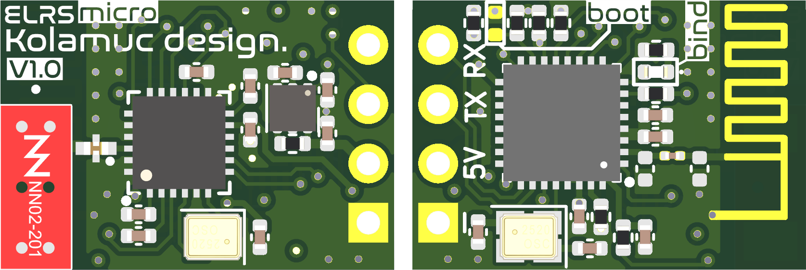

  <b>
   <h1>
      ExpressLRS micro
   </h1>
   <h6>
     V1
   </h6>
  </b>

*Features*
* **Size**: 17x12mm
* **Gain**: 3.2dBi
* **Radio Efficiency**: >80%
* **Recommend Drone**: Whoop Drone
* **Range**: About 600 meters
* **Input voltage**: 5V
* **MCU**: ESP8285
* **Antenna**: Integrated SMD ceramic antenna
* **Frequency bands (Nano receiver 2.4G version)**: 2.4GHz ISM
* **Telemetry power**: 17mW
* *`DIY_2400_RX_ESP8285_SX1280_via_UART`*
